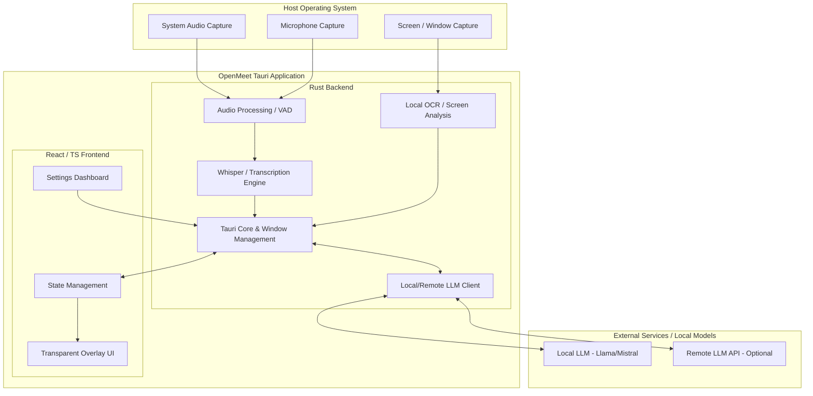

# System Architecture

```mermaid
flowchart TD
    subgraph Host OS [Host Operating System]
        SA[System Audio Capture]
        Mic[Microphone Capture]
        SC[Screen / Window Capture]
    end

    subgraph OpenMeet [OpenMeet Tauri Application]
        subgraph Frontend [React / TS Frontend]
            OverlayUI[Transparent Overlay UI]
            SettingsUI[Settings Dashboard]
            StateMgr[State Management]
        end

        subgraph Backend [Rust Backend]
            Core[Tauri Core & Window Management]
            AudioProc[Audio Processing / VAD]
            Transcriber[Whisper / Transcription Engine]
            OCR[Local OCR / Screen Analysis]
            LLMClient[Local/Remote LLM Client]
        end
    end

    subgraph External [External Services / Local Models]
        LocalLLM[Local LLM - Llama/Mistral]
        RemoteAPI[Remote LLM API - Optional]
    end

    SA --> AudioProc
    Mic --> AudioProc
    SC --> OCR

    AudioProc --> Transcriber
    Transcriber --> Core
    OCR --> Core

    Core <--> LLMClient
    LLMClient <--> LocalLLM
    LLMClient <--> RemoteAPI

    Core <--> StateMgr
    StateMgr --> OverlayUI
    SettingsUI --> Core
```
