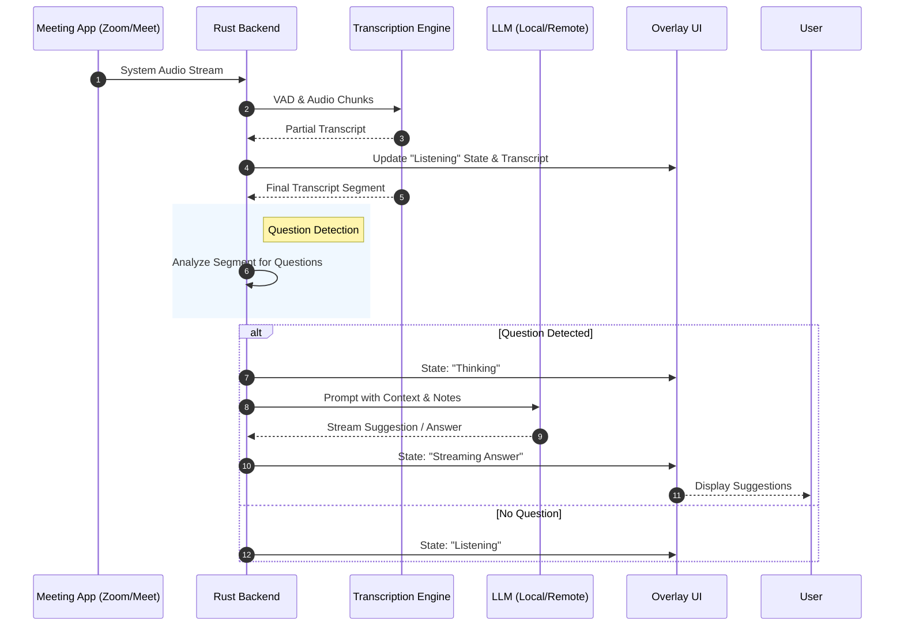

# Meeting Interaction Sequence

```mermaid
sequenceDiagram
    autonumber
    participant Meeting as Meeting App (Zoom/Meet)
    participant Core as Rust Backend
    participant Transcriber as Transcription Engine
    participant LLM as LLM (Local/Remote)
    participant UI as Overlay UI

    Meeting->>Core: System Audio Stream
    Core->>Transcriber: VAD & Audio Chunks
    Transcriber-->>Core: Partial Transcript
    Core->>UI: Update "Listening" State & Transcript
    Transcriber-->>Core: Final Transcript Segment
    
    rect rgb(240, 248, 255)
        note right of Core: Question Detection
        Core->>Core: Analyze Segment for Questions
    end

    alt Question Detected
        Core->>UI: State: "Thinking"
        Core->>LLM: Prompt with Context & Notes
        LLM-->>Core: Stream Suggestion / Answer
        Core->>UI: State: "Streaming Answer"
        UI-->>User: Display Suggestions
    else No Question
        Core->>UI: State: "Listening"
    end
```
