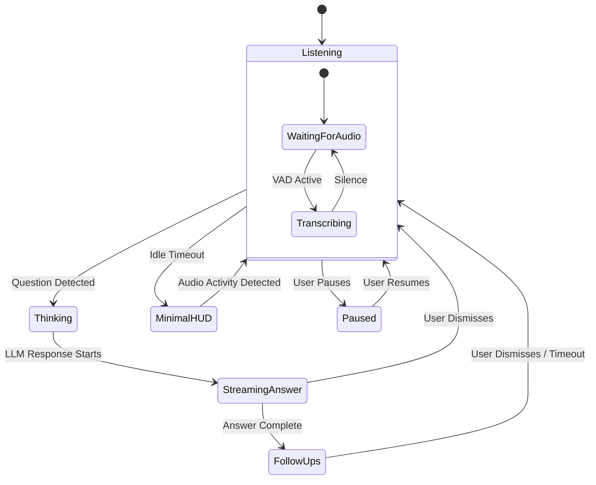

# Overlay State Machine

```mermaid
stateDiagram-v2
    [*] --> Listening
    Listening --> Thinking : Question Detected
    Thinking --> StreamingAnswer : LLM Response Starts
    StreamingAnswer --> FollowUps : Answer Complete
    StreamingAnswer --> Listening : User Dismisses
    FollowUps --> Listening : User Dismisses / Timeout
    
    Listening --> MinimalHUD : Idle Timeout
    MinimalHUD --> Listening : Audio Activity Detected
    
    Listening --> Paused : User Pauses
    Paused --> Listening : User Resumes
    
    state Listening {
        [*] --> WaitingForAudio
        WaitingForAudio --> Transcribing : VAD Active
        Transcribing --> WaitingForAudio : Silence
    }
```
