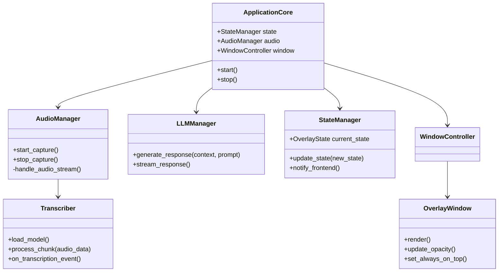

# Core Component Classes

```mermaid
classDiagram
    class ApplicationCore {
        +StateManager state
        +AudioManager audio
        +WindowController window
        +start()
        +stop()
    }
    
    class AudioManager {
        +start_capture()
        +stop_capture()
        -handle_audio_stream()
    }
    
    class Transcriber {
        +load_model()
        +process_chunk(audio_data)
        +on_transcription_event()
    }
    
    class LLMManager {
        +generate_response(context, prompt)
        +stream_response()
    }
    
    class StateManager {
        +OverlayState current_state
        +update_state(new_state)
        +notify_frontend()
    }
    
    class OverlayWindow {
        +render()
        +update_opacity()
        +set_always_on_top()
    }

    ApplicationCore --> AudioManager
    ApplicationCore --> StateManager
    ApplicationCore --> WindowController
    AudioManager --> Transcriber
    ApplicationCore --> LLMManager
    WindowController --> OverlayWindow
```
